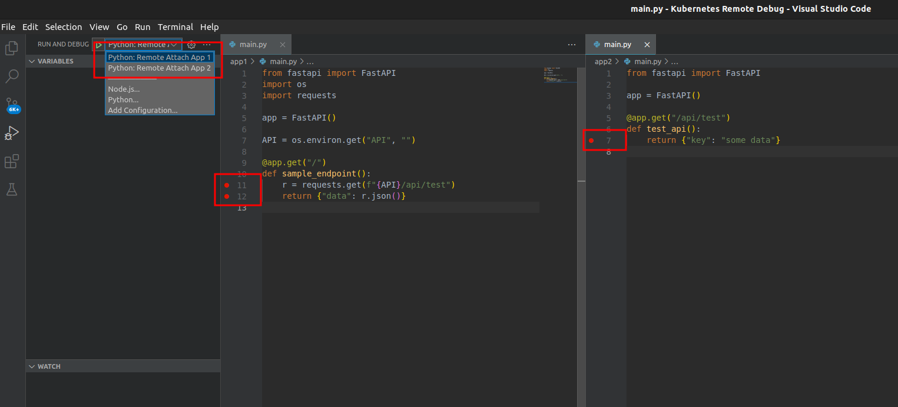
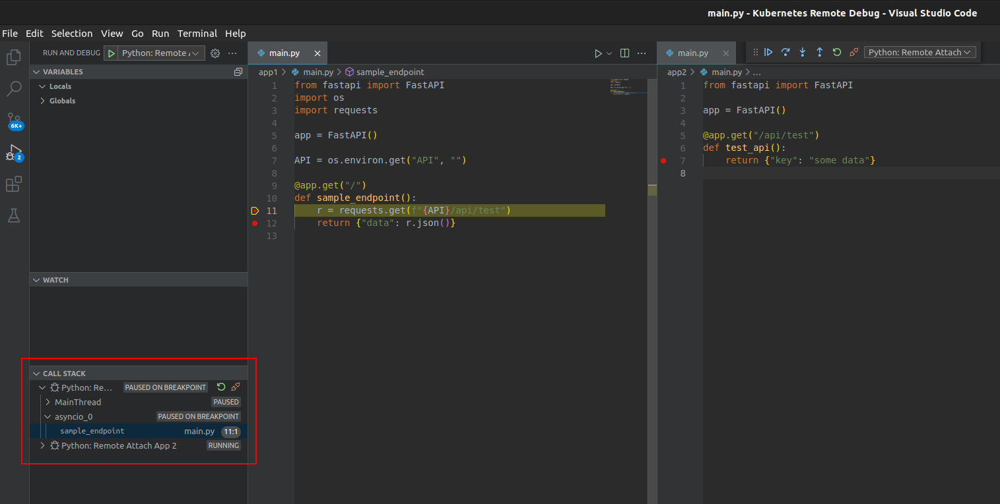

# Remote Debugging Python Applications Runnning on Kubernetes

Setup for remote and interactive debugging of Python application running in Kubernetes.

Works with VS Code debugger. Can be used to debug multiple containers/pods at the same time (Could not make it work both at the same time)

Repository includes two sample applications (`app1` and `app2` directories) and debug configuration for VS Code.

Inspired by this great article:

- [Remote Interactive Debugging of Python Applications Running in Kubernetes](https://betterprogramming.pub/remote-interactive-debugging-of-python-applications-running-in-kubernetes-17a3d2eed86f)

----------

## Setup

Create cluster:

```shell
kind create cluster --config=config.yaml
```

Build and deploy applications:

```shell
docker build -f app1/Dockerfile -t python-debugging-app1:v0.1.0 app1
docker build -f app2/Dockerfile -t python-debugging-app2:v0.1.0 app2

kind load docker-image python-debugging-app1:v0.1.0
kind load docker-image python-debugging-app2:v0.1.0

# ... or docker push ...
NAMESPACE=test
kubectl create ns "${NAMESPACE}"  -o=yaml --dry-run=client | kubectl apply --server-side -f -
kubectl apply --server-side -f deployment.yaml
```

Build debugger image:

```shell
docker build -f debugger.Dockerfile -t python-debugger:v0.1.0 .
kind load docker-image python-debugger:v0.1.0
```

To debug:

1. Inject the ephemeral container into application Pods:

```shell
# Deployment patch
APP1_POD=$(kubectl get -l=app=app1 -n "${NAMESPACE}" pod --output=jsonpath='{.items[0].metadata.name}')
APP2_POD=$(kubectl get -l=app=app2 -n "${NAMESPACE}" pod --output=jsonpath='{.items[0].metadata.name}')
bash create-debug-container.sh "${NAMESPACE}" "$APP1_POD" app1
bash create-debug-container.sh "${NAMESPACE}" "$APP2_POD" app2
```

2. Forward application and debugger traffic to local:

```shell
kubectl port-forward -n "${NAMESPACE}" "$APP1_POD" 5000:5000 5678:5678 &
kubectl port-forward -n "${NAMESPACE}" "$APP2_POD" 5679:5678 &
```

3. Add breakpoints to your code
4. Launch debugger(s)



5. Query application API (`curl -v 127.0.0.1:5000`)


